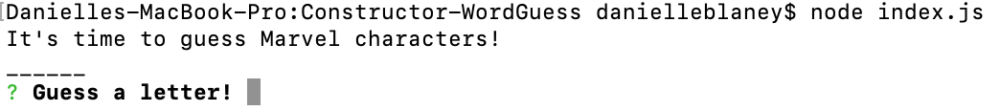
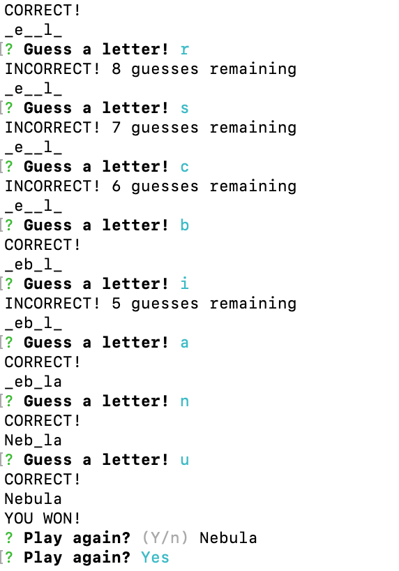

# Constructor-WordGuess
Advanced JavaScript Assignment: Constructor Word Guess

## Overview

This is a Word Guess command-line game using constructor functions.

## How to install

Dependencies are saved in the package json, once you have cloned down the repository you will need to run npm install in your gitbash or terminal.

then in gitbash or terminal ----> node index.js

------------------------------------------------------------------------------------

